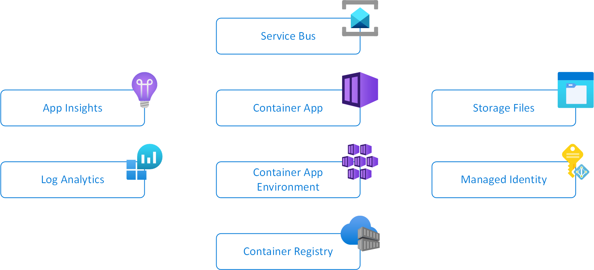

# MessageRouter
A component designed to receive and send messages from Azure Service Bus based on their message type

## Description
This component is powered by [Azure Services Bus](https://learn.microsoft.com/en-us/azure/service-bus-messaging/), [NJsonSchema](https://github.com/RicoSuter/NJsonSchema), and [RulesEngine](https://github.com/microsoft/RulesEngine).  It is packaged as a container and implemented as an ASP.NET 7 web api.  The program may be run in any container environment with connectivity to the required services, but here, it is shown as an [Azure Container App](https://learn.microsoft.com/en-us/azure/container-apps/).

The component is designed to receive a JSON message from an Azure Service Bus Queue (ingress).  Then, it uses a combinaiton of the RulesEngine and NJsonSchema to determine the message's message type (schema).  Once determined, the component sends the message to the appropriate egress queue.  If, however, the message schema cannot be determined, the component will forward the message to an egress queue called, 'unknown.'


The component must be configured in order to perform its function.  Schema detection is based on a combination of NJsonSchema and RulesEngine logic.  In order for the component to properly detect a particular schema, the schema must be registered in the component's configuration file (workflow.json).  This configuration file is based on the schema specified by RulesEngine and has the following syntax:

```
{
    "WorkflowName": "Workflow01",
    "Rules": [
        {
            "RuleName": "Rule01",
            "SuccessEvent": "Schema01.json",
            "ErrorMessage": "Not Schema01.json",
            "Expression": "Utility.Validate(input1, \"Schema01.json\") == true"
        },
        {
            "RuleName": "Rule02",
            "SuccessEvent": "Schema02.json",
            "ErrorMessage": "Not Schema02.json",
            "Expression": "Utility.Validate(input1, \"Schema02.json\") == true"
        }
    ]
}
```

Above, the configuration file includes two rules that both employ a utility method in order to detect the input message's message type.  According to this configuration, the component will check to see if the input message is either an instance of Schema01.json or Schema02.json.  In order to do this, the component must have access to both Schema01.json and Schema02.json.  In other words, the component must have access to any schemas that are to be used for message type detection at runtime.  Like the configuration file itself, the component allows its user to specify a location for these schemas.

## Usage

This application has been prepared for use with the [Azure Developer Command Line Interface](https://learn.microsoft.com/en-us/azure/developer/azure-developer-cli/reference).  See the [Install azd](https://learn.microsoft.com/en-us/azure/developer/azure-developer-cli/install-azd?tabs=baremetal%2Cwindows) guide for instructions on how to install the CLI.

In order to use the CLI for this project, simply do the following:

```
# obtain a copy of the project
git clone https://github.com/jeffvan98/MessageRouter.git [DIRECTORY]

# change to the project directory
cd [DIRECTORY]

# log in
azd login

# initialize an environment for the component; specify an environment name; choose a subscription and location
azd init 

# provision the infrastructure
azd provision

# deploy the code
azd deploy
```

## Deployment

This component is demonstrated with the use of Azure Container Apps.  Once the above technique has been used to deploy the component, you will have an Azure Deployment that looks like this diagram:



The infrastructure will be composed of:
- A container registry.  The code will be compiled, packaged and stored for use on this registry.
- A container app environment.  At runtime, the code will apply configuration described by this environment, for example, storage configuraiton.
- A container app.  The code will run in this container app.  Here, important configuration values are specified as environment variables, such as the ingress queue name.  The code will also obtain its workflow configuraiton and schema data from the specified Azure Files Share (which is mounted as a volume within the container app).  
- A storage account with Azure Files and a File Share.  This file share will hold both the workflow file and schema files used by the application.
- A Service Bus.  This service bus will have the ingress queue as well as an egress queue for unknown messages.  Create additional egress queues as needed.
- A monitoring infrastrcture comrpised of Azure Log Analytics and App Insights
- A managed identity which is used by the Container App when interacting with the Service Bus and Container Registry
  
## Component Configuration

The component operates as a container and obtains its configuration through these environment variables:
Key | Description | Example
--- |------------ | -------
AZURE\_CLIENT\_ID | The application is designed to run as a User Assigned Managed Identity.  Specify the client id of this managed identity. | b5f2284d-1651-4621-9bcb-c28904745a55
ServiceBus\_\_FullyQualifiedNamespace | The fully qualified namespace of the Azure Service Bus to be used by the component | sb42.servicebus.windows.net
MessageRouter\_\_IngressQueue | The name of the ingress (input) Service Bus Queue | ingress 
MessageRouter\_\_WorkflowFile | The full path and filename of the workflow file to be used by the code.  This file to be imported into the app as a volume | /app/config/workflow.json
MessageRouter\_\_SchemaDirectory | The full path to the schema files that are to be used by the component | /app/config/schemas
ApplicationInsights\_\_ConnectionString | The Application Insights connection string to be used by the component |